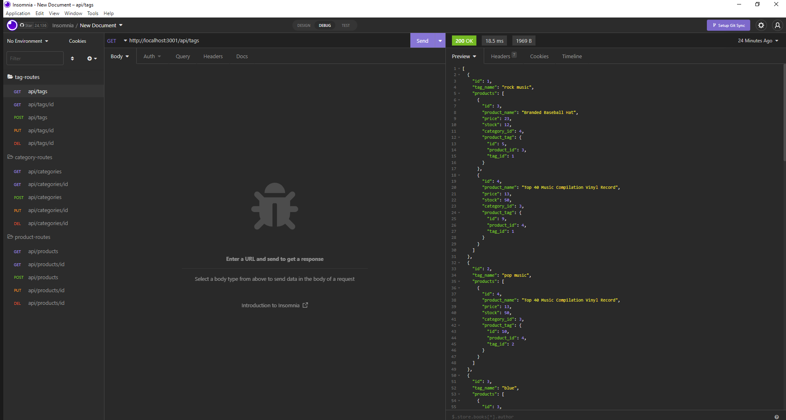

# E-commerce-Backend-API

## Description

  This application uses express, sequelize, and mysql to run a company shopping sites backend. This allows the site to pull, display, create and delete information
  to allow the site to stay up to date with stock and demand.

  ## Table of Contents

  - [Installation](#installation)
  - [Usage](#usage)
  - [Contributing](#contributing)
  - [License](#license)
  - [Tests](#tests)
  - [Questions](#questions)

  ## Installation

  To install this project, download the files from my repository at https://github.com/AndrewKamSki/E-commerce-Backend-API. From there run an 'npm install' in the console to load in the correct packages, then run a 'npm start' to start the application!

  ## Usage
  A walkthrough video of the app's capabilities! => https://drive.google.com/file/d/1l_gRDKnwO5FksWOJkslMES1pGqNLzPSA/view?usp=sharing

  Once you have run the npm install, navigate to the db/ folder and open mysql. Run a 'SOURCE schema.sql;' in the console to initialize the database. Exit out of mysql, and navigate back to the main folder. There, seed the data by running a 'node seeds' to seed the database. Then run and npm start to initialize the program

  In insomnia, you can use the GET, POST, PUSH, and DELETE routes in the routes folder to receive, add new, update, and delete data

  

  ## Contributing

  No other contributors were on this project

  ## License
  The License being used is: MIT
  If you would like to read more on this please click the badge to navigate to the license page: 
  

  ## Tests

  No tests have been created yet for this project
  
  ## Questions

  If you would like to collaborate or have any questions feel free to contact me on my Github!
    - [My github](https://github.com/AndrewKamSki)
